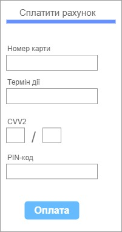
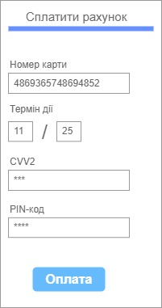
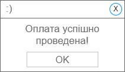

| NFR ID | Test Case ID | Опис кроків тестового сценарію | Опис очікуваних результатів |
| ------ | ------------ | ------------------------------ | --------------------------- |
| NFR1.1 | TC1.6 | Початкові умови: відсутні.  Кроки сценарію: відсутні. | Екранна форма:   |
| NFR1.1 | TC1.7 | Початкові умови: успішно пройдено TC1.6.  Кроки сценарію:  1) В поле "Номер карти" внесено значення "4869365748694852"  2) В поле "Термін дії" внесено значення "11/25"  3) В поле "CVV2" внесено значення "481", яке відображається символами *  4) В поле "PIN-код" внесено значення "3433", яке відображається символами * | Екранна форма:   |
| NFR1.1 | TC1.8 | Початкові умови: успішно пройдено TC1.7.  Кроки сценарію:  1) Натиснуто кнопку "Оплата" | Екранна форма:   |
