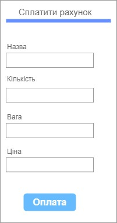
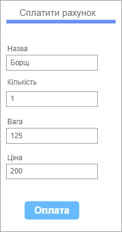
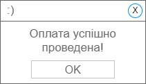

| NFR ID | Test Case ID | Опис кроків тестового сценарію | Опис очікуваних результатів |
| ------ | ------------ | ------------------------------ | --------------------------- |
| NFR1.1 | TC1.9 | Початкові умови: відсутні.  Кроки сценарію: відсутні. | Екранна форма:   |
| NFR1.1 | TC1.10 | Початкові умови: успішно пройдено TC1.9.  Кроки сценарію:  1) В поле "Назва" внесено значення "Борщ"  2) В поле "Кількість" внесено значення "1"  3) В поле "Вага" внесено значення "125"  4) В поле "Ціна" внесено значення "200" | Екранна форма:   |
| NFR1.1 | TC1.11 | Початкові умови: успішно пройдено TC1.10.  Кроки сценарію:  1) Натиснуто кнопку "Оплата" | Екранна форма:   |
